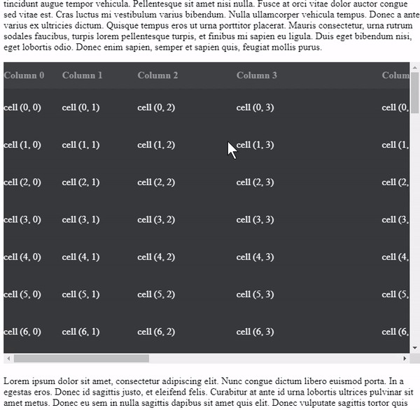

[](https://badge.fury.io/js/fucking-react-table)



# Fucking React Table

A react table component with fucking difficult features, including

- Virtualized rows with fucking native table elements
- Sticky header
- Freeze column
- ~~Placeholder~~(WIP)
- ~~Sticky horizontal scrollbar~~(WIP)
- ~~Resizable column~~(WIP)

for both fit-content height table and fixed height table.

## Playground

[](https://gocreating.github.io/fucking-react-table/?path=/story/quick-start-default--small-table)

## Why

- Why using native table element?

  Because it is fucking semantic and elegant.

- Why reinventing the wheel?

  Considering sticky headers or freeze columns, I think reinventing is fucking more efficient than reusing.

- Why the project is named `fucking-react-table`?

  I originally named it `react-virtual-table`, but this name was fucking registered. The package even seems like a fucking useless hello world project. So I just give a fucking name.

## Installation

```
npm install --save fucking-react-table
```

## Quick Start

``` jsx
import FuckTable from 'fucking-react-table'

const data = [
  { id: 'a', value: 'Apple' },
  { id: 'b', value: 'Banana' },
]
const Tr = FuckTable.Tr
const Th = FuckTable.Th
const Td = FuckTable.Td

return (
  <FuckTable
    data={data}
    headerRowHeight={60}
    rowHeight={80}
    renderHeader={() => (
      <Tr>
        <Th cellWidth={100}>ID</Th>
        <Th cellWidth={150}>Fruit</Th>
      </Tr>
    )}
    renderRow={row => (
      <Tr key={row.id}>
        <Td cellWidth={100}>{row.id}</Td>
        <Td cellWidth={150}>{row.value}</Td>
      </Tr>
    )}
  />
)
```

## Custom Styling

``` jsx

import FuckTable from 'fucking-react-table'
import styled from 'styled-components'

const Table = styled(FuckTable)`
  background-color: #26282b;
`

const Tr = styled(FuckTable.Tr)`
  background-color: rgb(53, 55, 58);
`

const Th = styled(FuckTable.Th)`
  background-color: rgb(62, 63, 66);
  color: rgb(156, 157, 158);
`

const Td = styled(FuckTable.Td)`
  background-color: rgb(53, 55, 58);
  color: #ffffff;
`
```

## Props

### FuckTable

| prop name | type | required | default | description |
| --------- | ---- | -------- | ------- | ----------- |
| `data` | array | yes | - | Data source of table rows. Each row will be passed as argument into `renderRow`. |
| `headerRowHeight` | number | yes | - | Fixed row height of table header. Table header is not virtualized and is always rendered. |
| `rowHeight` | number | yes | - | Fixed row height of table row. |
| `columnCount` | number | conditional | undefined | If your column count will change during runtime, you must pass current column count. This prop is only for detecting width changing and won't affect any other table behaviors. |
| `maxHeight` | number | optional | -1 | Set a fixed max height value (in pixel). If `maxHeight` is negative (default to -1), the table will fit its height to contents. |
| `throttleWait` | number | optional | 16 | Throttle wait interval in milliseconds for restoring virtualized table rows. Default to 16ms, which is about 60fps (1000ms / 60).
| `preRenderRowCount` | number | optional | 0 | Set how many margin rows should be pre-render before they are displayed in viewport. |
| `globalStickyHeader` | bool | optional | false | Toggle sticky header when global page scrolls |
| `localStickyHeader` | bool | conditional | false | Required when `rowHeight` is set. Toggle sticky header when table container scrolls. |
| `enableStickyHeaderShadow` | bool | optional | true | Toggle scroll shadow of sticky header. |
| `enableFreezeColumnShadow` | bool | optional | true | Toggle scroll shadow of frozen column. |
| `freezeColumnShadowLeftOffset` | number | conditional | null | Required when `enableFreezeColumnShadow` is `true`. This prop decides the x-axis position of shadow. |
| `renderHeader` | func | optional | () => {} | A render function for table head section. |
| `renderRow` | func | optional | () => {} | A render function for table body section. |

### FuckTable.Tr

No props.

### FuckTable.Th

| prop name | type | required | default | description |
| --------- | ---- | -------- | ------- | ----------- |
| `cellWidth` | number | yes | - | Fixed value in px to decide the width of current `FuckTable.Th` |
| `freezeLeftOffset` | number \| undefined | conditional | undefined | If you want to freeze columns, this prop sets the freeze left offset in px. You should set the same offset to `FuckTable.Td` for the same column. |

### FuckTable.Td

| prop name | type | required | default | description |
| --------- | ---- | -------- | ------- | ----------- |
| `cellWidth` | number | yes | - | Fixed value in px to decide the width of current `FuckTable.Td` |
| `freezeLeftOffset` | number \| undefined | conditional | undefined | If you want to freeze columns, this prop sets the freeze left offset in px. You should set the same offset to `FuckTable.Th` for the same column. |

## Development

```
npm start
```

## Storybook

Launch local storybook

```
yarn storybook
```

Deploy to gh-pages

```
yarn deploy-storybook
```

## Changelog

### `0.1.1`

Reduce bundle size by removing unnecessary dependencies

### `0.1.0`

Initial release with following features:

- virtualized rows
- sticky header
- freeze column
